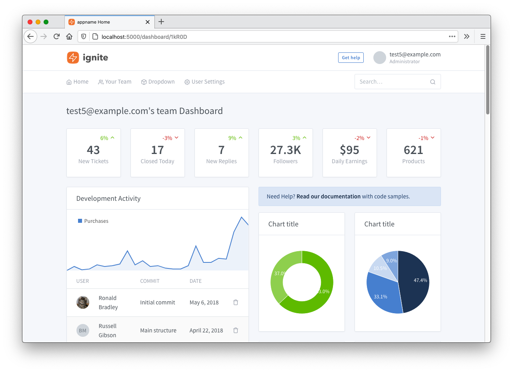
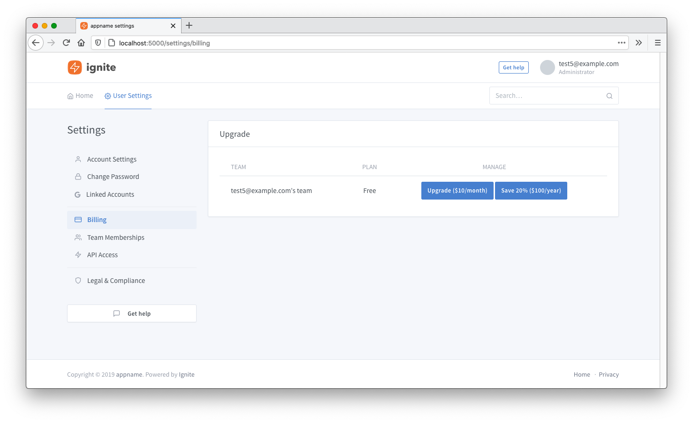
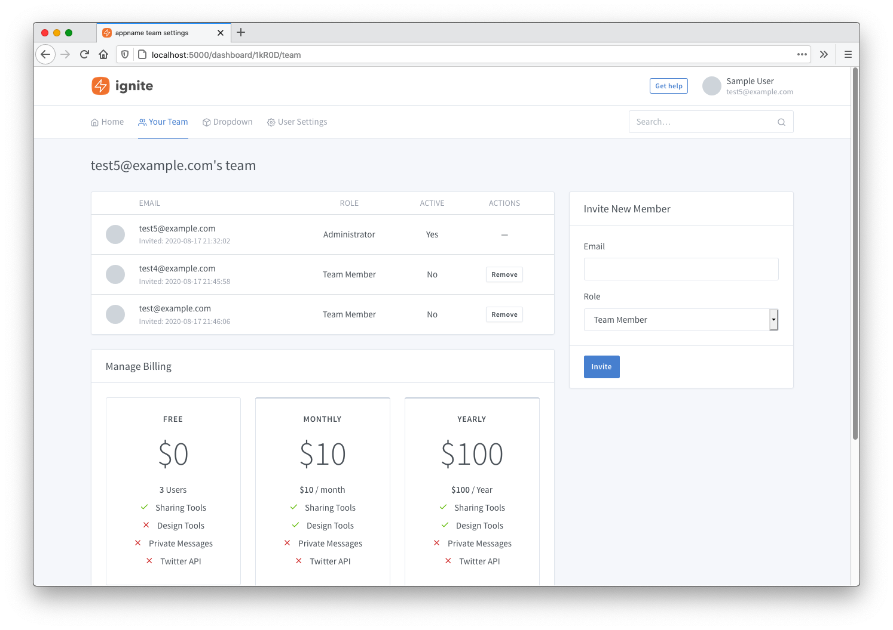
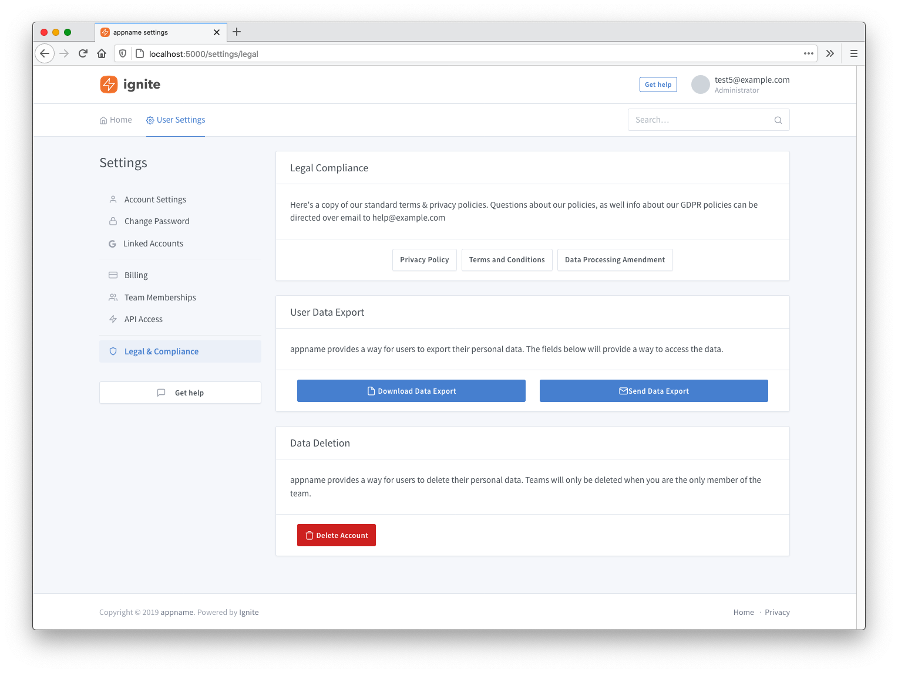
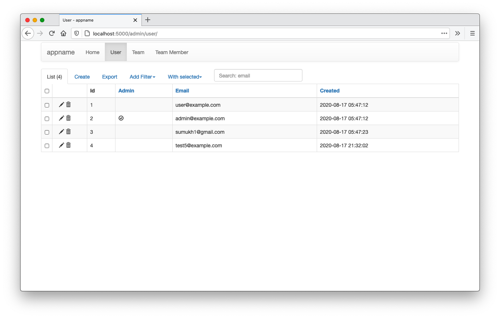
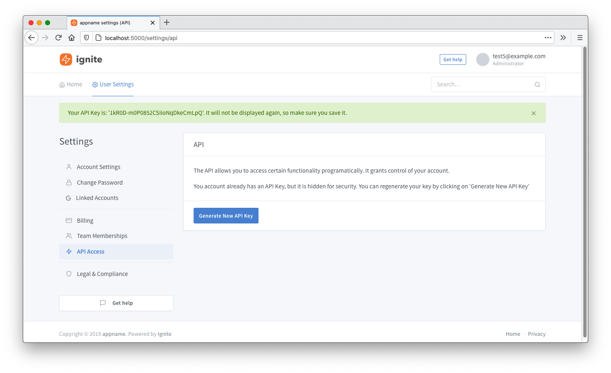
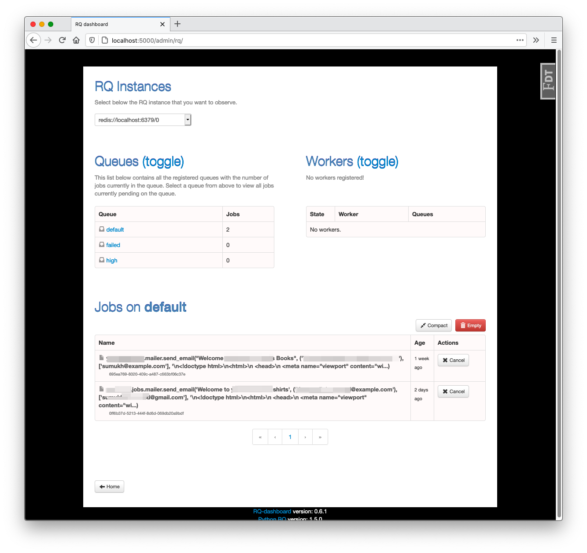
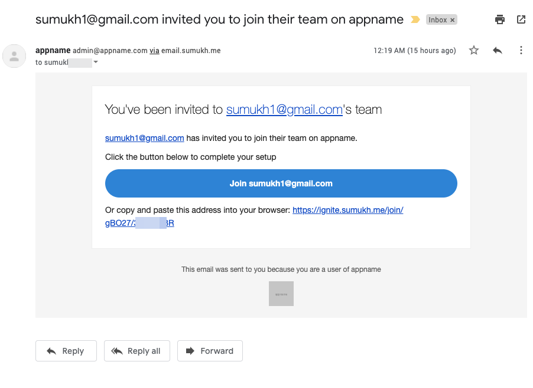
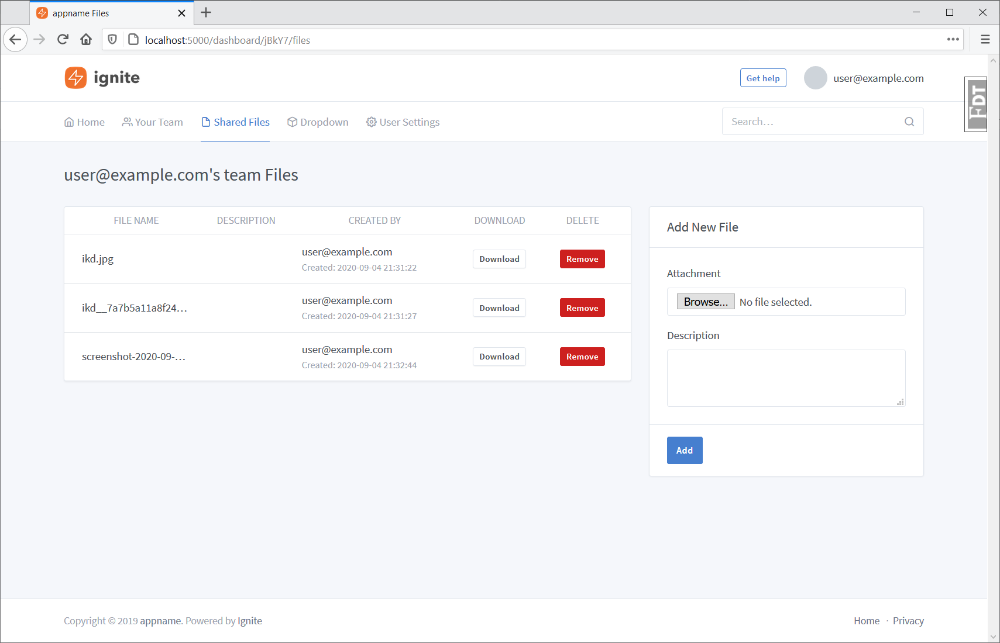
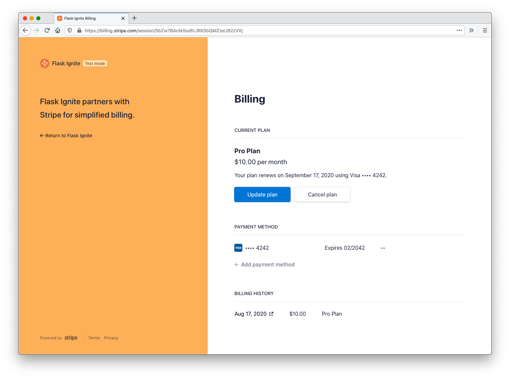

[](https://github.com/sumukh/ignite)

# Ignite for Flask [](https://github.com/Sumukh/Ignite/actions/workflows/flask-pytest.yml)

Ignite is a scaffold for starting new Flask applications. It takes care of the boilerplate code (like User Registration, OAuth, Teams, and Billing), allowing you to focus on building your application. Ignite is built upon best practices for modern Flask applications.

## Features

| Features                              | Status                                       | Details                                                                                    |
| ------------------------------------- | -------------------------------------------- | ------------------------------------------------------------------------------------------ |
| User Authentication                   | ✅                                           | User Login, Registration, Forgot Password, Email Confirmation                              |
| OAuth Login                           | ✅                                           | Login or Register with Google, Twitter, Facebook, etc.                                     |
| Teams/Groups                          | ✅                                           | Multi user teams & groups (with Invite Emails)                                             |
| User Export & Deletion Request        | ✅                                           | Allows users to export their data (for GDPR compliance)                                    |
| API                                   | ✅                                           | API (with user tokens) users to access data                                                |
| Stripe Product Checkout               | ✅                                           | One time item purchases with credit cards and receipts (using Stripe)                      |
| Heroku/Docker Deployment              | ✅                                           | Deployment instructions for some platforms. Works on AWS & Google Cloud                    |
| Send Emails                           | ✅                                           | Send email notifications from the application                                              |
| Admin Dashboard                       | ✅                                           | Admin dashboard to edit data                                                               |
| File Uploads                          | ✅                                           | File uploads to cloud storage providers                                                    |
| Basic Test Suite                      | ✅                                           | Starting point for you to build out tests                                                  |
| VS Code Debugger & Editor             | ✅                                           | Configured to make you productive                                                          |
| Tested on Windows 10, OSX, and Ubuntu | ✅                                           | Using Python 3                                                                             |
| SaaS Recurring Billing                | 💲 (Requires purchasing a license to Ignite) | Team Billing, Usage Based Billing or Unlimited Plans                                       |
| Commercial Usage                      | 💲 (License Required)                        | Commercial Usage requires a purchased license                                              |
| Video Content                         | 💲                                           | Available as part of [the Fullstack Flask course](https://www.newline.co/fullstack-flask/) |

## How to Buy

| Store                  | Comes With                                                                                                                     | Price                                                                       |
| ---------------------- | ------------------------------------------------------------------------------------------------------------------------------ | --------------------------------------------------------------------------- |
| Fullstack Flask Course | The Fullstack Flask Course & Book, hours of videos explaining how to build a SaaS in Flask, and a single license to Ignite Pro | [On Sale (for ~$199) at Newline »](https://www.newline.co/fullstack-flask/) |
| Commercial License     | A license for usage on a single site                                                                                           | [($199) »](https://gumroad.com/l/xFvLo)                                     |

## Setup

Usage of Python 3 is required. It can be installed [on Python.org](https://www.python.org/downloads/)

```
# Optional but recommended:
python3 -m venv env; source env/bin/activate

pip install -r requirements.txt
./manage.py server # or `FLASK_APP=manage FLASK_ENV=development flask run`
```

## Development

```
# Development
# If using a virtual env: source env/bin/activate
./manage.py resetdb # to seed data
FLASK_APP=manage FLASK_ENV=development flask run

# Go to localhost:5000 in a browser and click on Login
# Login with the following credentials "user@example.com", "test

# Production documentation in the repository.
```

## Testing

Github Actions is configured to run tests and produce code coverage metrics.

To run tests locally, try this command:

```
APPNAME_ENV=test ./manage.py test --coverage
```

### Local Secrets

To configure OAuth login and Stripe billing in development, you will need to set some environment variables. See `.env.local.sample` for an example.

```bash
cp .env.local.sample .env.local
# Edit .env.local with your Stripe & Google test keys
source .env.local
flask run
```

You may also want to change some of the constants in `appname.constants` and the `services/branding.py` file to change the name of the application in the UI.

## Deployment

Ignite is not tied to a specific platform for deployment, but it works well on [Heroku](http://heroku.com) and [Dokku](http://dokku.viewdocs.io/dokku/) with minimal configuration.

It is also designed to work well on other cloud providers such as AWS, Google Cloud, and DigitalOcean.

Documentation is currently provided for installations on Dokku.

## Stripe Webhooks Locally

- Install the [Stripe CLI](https://stripe.com/docs/stripe-cli)
- Login to the Stripe CLI (`stripe login`)
- Run `stripe listen --forward-to localhost:5000/webhooks/stripe`
- Use the webhook secret and configure your app to use it (`export STRIPE_WEBHOOK_SECRET=whsec_...`)
- To replay an event in a seperate console: `stripe events resend evt_XYZ`

## Screenshots

| Screenshot                              | Name                                                    |
| --------------------------------------- | ------------------------------------------------------- |
| Login / Signup / OAuth / Password Reset |            |
| Dashboard                               |    |
| Saas Subscription Billing + Console     |        |
| Teams                                   |              |
| GDPR/Legal                              |              |
| Admin                                   |            |
| API Tokens                              |                |
| Delayed Jobs                            |              |
| Emails                                  |           |
| File Uploads                            |     |
| Stripe Customer Portal Integration      |  |

## License

This is a commercial product. You may purchase a license for commercial use at [Ignite Website](https://ignite.sumukh.me)

Here's a summary:

| Features                                     | Ignite         | (License) Ignite Premium |
| -------------------------------------------- | -------------- | ------------------------ | --- |
| Cost                                         | Free           | $199 per site            |     |
| Private Non Commercial Use                   | ✅             | ✅                       |
| Commercial Use                               | No             | ✅                       |
| Ability to remove "Powered by Ignite" footer | No             | ✅                       |
| Video Tutorials                              | No             | ✅                       |
| Re-license                                   | No             | Contact us               |
| Support                                      | No             | No                       |
| Warranty                                     | Provided As-is | Provided As-is           |
| Refunds                                      | N/A            | 30 Day                   |

You can purchase a license at the [Ignite Store](https://gumroad.com/l/xFvLo) or on [Newline as part of the Fullstack Flask course](https://www.newline.co/fullstack-flask/)

For more detailed license information see LICENSE.md

## Credits

Design elements from [tabler](https://github.com/tabler/tabler) & Bootstrap 4.

Built off of [Flask Foundation](https://jackstouffer.github.io/Flask-Foundation/) and the [bootstrapy project](https://github.com/kirang89/bootstrapy)

### Extra Reading

Only building out an API using Flask?

- Use [create-flask-api](https://github.com/Sumukh/create-flask-api)

**Course: [Fullstack Flask: Build a SaaS using Python and Flask](https://www.newline.co/fullstack-flask/)**

Best practices List:

- [Larger Applications With Flask](http://flask.pocoo.org/docs/patterns/packages/).
- [Creating Websites With Flask](http://maximebf.com/blog/2012/10/building-websites-in-python-with-flask/)
- [Getting Bigger With Flask](http://maximebf.com/blog/2012/11/getting-bigger-with-flask/)
- [Miguel Grinberg's Blog](https://blog.miguelgrinberg.com/category/Python)
